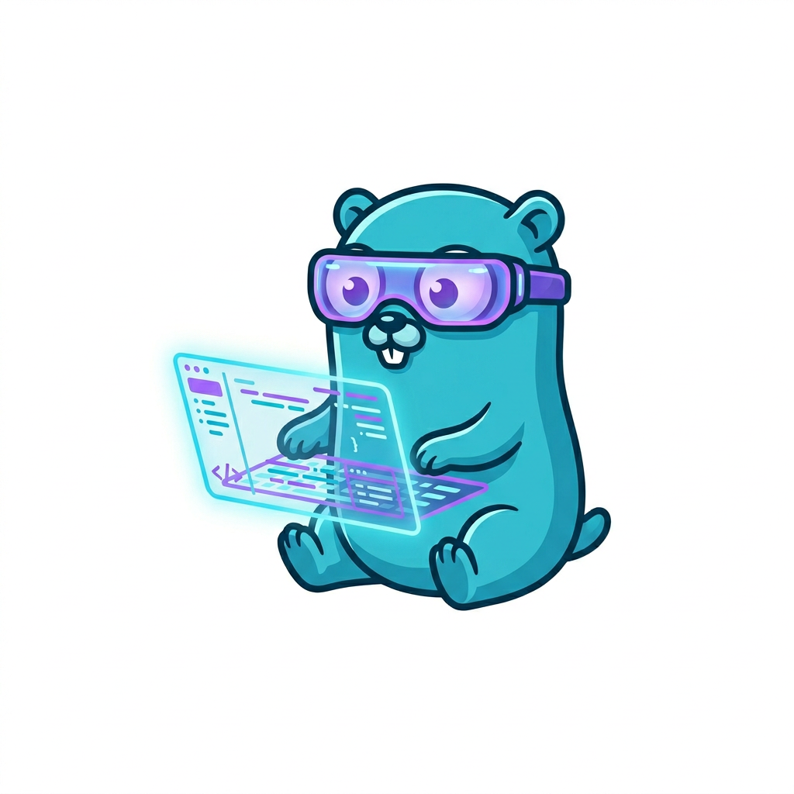
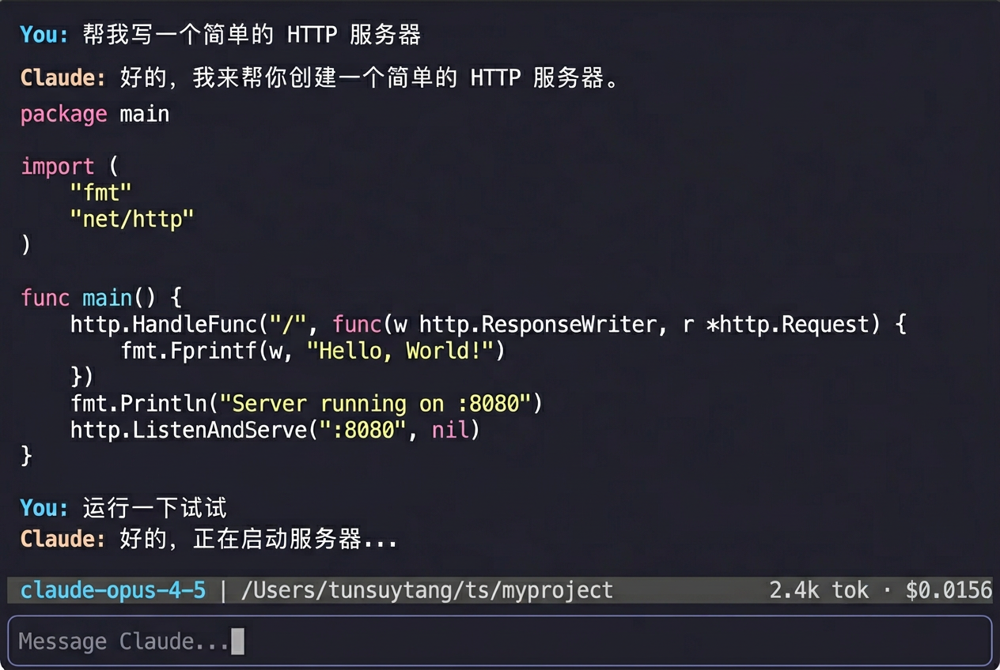

<p align="center">
  
</p>

<h1 align="center">Claude Code Go</h1>

<p align="center">
  <strong>🤖 Reimplementación en Go de Claude Code — Asistente de programación con IA en tu terminal</strong>
</p>

<p align="center">
  <a href="https://golang.org/dl/"></a>
  <a href="https://goreportcard.com/report/github.com/tunsuy/claude-code-go"></a>
  <a href="https://pkg.go.dev/github.com/tunsuy/claude-code-go"></a>
  <a href="https://github.com/tunsuy/claude-code-go/actions/workflows/ci.yml"></a>
  <a href="https://github.com/tunsuy/claude-code-go/releases"></a>
  <a href="LICENSE"></a>
  <a href="https://github.com/tunsuy/claude-code-go/pulls"></a>
</p>

<p align="center">
  <a href="README.md">English</a> •
  <a href="README.zh-CN.md">简体中文</a> •
  <a href="README.ja.md">日本語</a> •
  <a href="README.ko.md">한국어</a> •
  <a href="README.es.md">Español</a> •
  <a href="README.fr.md">Français</a>
</p>

---

<p align="center">
  
</p>

---

## ¿Qué es esto?

Este proyecto es una **reimplementación completa en Go de [Claude Code](https://claude.ai/code)** — el CLI oficial de TypeScript de Anthropic — reescrito módulo por módulo en Go, cubriendo todas las características principales: TUI, uso de herramientas, sistema de permisos, coordinación multi-agente, protocolo MCP, gestión de sesiones y más.

### Construido completamente por agentes de IA — cero código escrito por humanos

> **Ningún humano escribió una sola línea de código de producción en este repositorio.**

Todo el proyecto — diseño de arquitectura, documentos de diseño detallados, implementación paralela, revisión de código, QA y pruebas de integración — fue producido por **9 agentes de IA Claude** colaborando en un flujo de trabajo multi-agente estructurado:

```
Agente PM          →  plan del proyecto, hitos, programación de tareas
Agente Tech Lead   →  diseño de arquitectura, revisión de documentos de diseño, revisión de código
Agent-Infra        →  capa de infraestructura (tipos, configuración, estado, sesión)
Agent-Services     →  capa de servicios (cliente API, OAuth, MCP, compactación)
Agent-Core         →  motor central (bucle LLM, despacho de herramientas, coordinador)
Agent-Tools        →  capa de herramientas (archivo, shell, búsqueda, web — 18 herramientas)
Agent-TUI          →  capa de UI (Bubble Tea MVU, temas, modo Vim)
Agent-CLI          →  capa de entrada (Cobra CLI, DI, fases de bootstrap)
Agente QA          →  estrategia de pruebas, aceptación por capa, pruebas de integración
```

Resultado: ~**7,000 líneas de código de producción + suite de pruebas completa**, con `go test -race ./...` pasando.

---

## Características

- **TUI interactiva** — Interfaz de terminal completa construida con [Bubble Tea](https://github.com/charmbracelet/bubbletea), con temas oscuro/claro
- **Uso de herramientas agénticas** — Lectura/escritura de archivos, ejecución de shell, búsqueda y más, todo mediado a través de una capa de permisos
- **Coordinación multi-agente** — Genera sub-agentes en segundo plano para tareas paralelas
- **Soporte MCP** — Conecta herramientas externas a través del [Model Context Protocol](https://modelcontextprotocol.io)
- **Memoria CLAUDE.md** — Carga automáticamente el contexto del proyecto desde archivos `CLAUDE.md` en el árbol de directorios
- **Gestión de sesiones** — Reanuda conversaciones anteriores; compacta automáticamente historiales largos
- **Modo Vim** — Atajos de teclado Vim opcionales en el área de entrada
- **Autenticación OAuth + clave API** — Inicia sesión con OAuth de Anthropic o proporciona una `ANTHROPIC_API_KEY`
- **18 comandos slash integrados** — `/help`, `/clear`, `/compact`, `/commit`, `/diff`, `/review`, `/mcp` y más
- **Respuestas en streaming** — Streaming de tokens en tiempo real con visualización de bloques de pensamiento

## Arquitectura

Claude Code Go está organizado en seis capas:

```
┌─────────────────────────────────────┐
│  CLI (cmd/claude)                   │  punto de entrada Cobra
├─────────────────────────────────────┤
│  TUI (internal/tui)                 │  interfaz Bubble Tea MVU
├─────────────────────────────────────┤
│  Tools (internal/tools)             │  herramientas de archivo, shell, búsqueda, MCP
├─────────────────────────────────────┤
│  Core Engine (internal/engine)      │  streaming, despacho de herramientas, coordinador
├─────────────────────────────────────┤
│  Services (internal/api, oauth,     │  API de Anthropic, OAuth, cliente MCP
│            mcp, compact)            │
├─────────────────────────────────────┤
│  Infra (pkg/types, internal/config, │  tipos, configuración, estado, hooks, plugins
│         state, session, hooks)      │
└─────────────────────────────────────┘
```

Consulta [`docs/project/architecture.md`](docs/project/architecture.md) para un desglose detallado.

## Requisitos

- Go 1.21 o posterior
- Una [clave API de Anthropic](https://console.anthropic.com/) **o** cuenta Claude.ai (OAuth)

## Instalación

### Desde el código fuente

```bash
git clone https://github.com/tunsuy/claude-code-go.git
cd claude-code-go
make build
# El binario se coloca en ./bin/claude
```

Añadir a tu `PATH`:

```bash
export PATH="$PATH:$(pwd)/bin"
```

### Usando `go install`

```bash
go install github.com/tunsuy/claude-code-go/cmd/claude@latest
```

## Inicio rápido

```bash
# Configura tu clave API (o usa OAuth — ver Autenticación abajo)
export ANTHROPIC_API_KEY=sk-ant-...

# Inicia una sesión interactiva en el directorio actual
claude

# Haz una pregunta única y sal
claude -p "Explica el punto de entrada principal de este proyecto"

# Reanuda la sesión más reciente
claude --resume
```

## Autenticación

**Clave API (recomendado para CI/scripts):**

```bash
export ANTHROPIC_API_KEY=sk-ant-...
```

**OAuth (recomendado para uso interactivo):**

```bash
claude /config    # abre el flujo OAuth en tu navegador
```

## Uso

### Modo interactivo

```
claude [flags]
```

| Flag | Descripción |
|------|-------------|
| `--resume` | Reanuda la sesión más reciente |
| `--session <id>` | Reanuda una sesión específica por ID |
| `--model <name>` | Sobrescribe el modelo Claude predeterminado |
| `--dark` / `--light` | Fuerza tema oscuro o claro |
| `--vim` | Habilita atajos de teclado Vim |
| `-p, --print <prompt>` | No interactivo: ejecuta un solo prompt y sale |

### Comandos slash

Escribe `/` en la entrada para ver todos los comandos disponibles:

| Comando | Descripción |
|---------|-------------|
| `/help` | Muestra todos los comandos |
| `/clear` | Limpia el historial de conversación |
| `/compact` | Resume el historial para reducir uso de contexto |
| `/exit` | Sale de Claude Code |
| `/model` | Cambia el modelo Claude |
| `/theme` | Alterna tema oscuro/claro |
| `/vim` | Alterna modo Vim |
| `/commit` | Genera un mensaje de commit git |
| `/review` | Revisa cambios recientes |
| `/diff` | Muestra el diff actual |
| `/mcp` | Gestiona servidores MCP |
| `/memory` | Muestra archivos CLAUDE.md cargados |
| `/session` | Muestra información de sesión |
| `/status` | Muestra estado de API/conexión |
| `/cost` | Muestra uso de tokens y costo estimado |

## Desarrollo

### Prerrequisitos

- Go 1.21+
- `golangci-lint` (opcional, para linting)

### Compilar y probar

```bash
# Compilar
make build

# Ejecutar todas las pruebas
make test

# Ejecutar pruebas con informe de cobertura
make test-cover

# Vet
make vet

# Lint (requiere golangci-lint)
make lint

# Compilar + probar + vet
make all
```

## Contribuir

¡Las contribuciones son bienvenidas! Por favor lee [CONTRIBUTING.md](CONTRIBUTING.md) antes de enviar un pull request.

Lista de verificación rápida:
- Haz fork del repo y crea una rama de características
- Asegúrate de que `make test` y `make vet` pasen
- Escribe pruebas para la nueva funcionalidad
- Sigue el estilo de código existente (ejecuta `gofmt ./...`)
- Abre un pull request usando la plantilla proporcionada

## Seguridad

Para reportar una vulnerabilidad de seguridad, consulta [SECURITY.md](SECURITY.md). **No** abras un issue público de GitHub para errores de seguridad.

## Licencia

Este proyecto está licenciado bajo la Licencia MIT — consulta [LICENSE](LICENSE) para más detalles.

## Proyectos relacionados

- [claude-code](https://github.com/anthropics/claude-code) — el CLI original en TypeScript
- [anthropic-sdk-go](https://github.com/anthropics/anthropic-sdk-go) — SDK oficial de Go para la API de Anthropic
- [Model Context Protocol](https://modelcontextprotocol.io) — estándar abierto para conectar IA a herramientas
