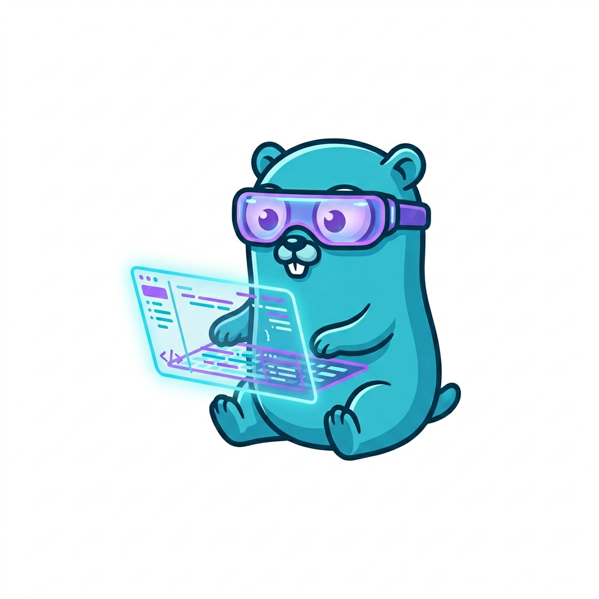
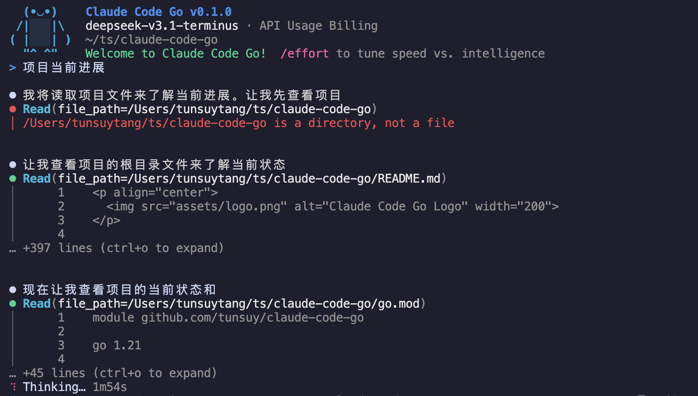
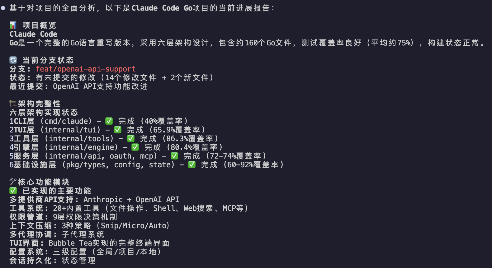

<p align="center">
  
</p>

<h1 align="center">Claude Code Go</h1>

<p align="center">
  <strong>🤖 Claude Code の Go 実装 — ターミナルで動く AI コーディングアシスタント</strong>
</p>

<p align="center">
  <a href="https://golang.org/dl/"></a>
  <a href="https://goreportcard.com/report/github.com/tunsuy/claude-code-go"></a>
  <a href="https://codecov.io/gh/tunsuy/claude-code-go"></a>
  <a href="https://pkg.go.dev/github.com/tunsuy/claude-code-go"></a>
  <a href="https://github.com/tunsuy/claude-code-go/actions/workflows/ci.yml"></a>
  <a href="https://github.com/tunsuy/claude-code-go/releases"></a>
  <a href="LICENSE"></a>
  <a href="https://github.com/tunsuy/claude-code-go/pulls"></a>
</p>

<p align="center">
  <a href="README.md">English</a> •
  <a href="README.zh-CN.md">简体中文</a> •
  <a href="README.ja.md">日本語</a> •
  <a href="README.ko.md">한국어</a> •
  <a href="README.es.md">Español</a> •
  <a href="README.fr.md">Français</a>
</p>

---

<p align="center">
  
  <br>
  <em>ファイル読み込みとリアルタイム思考表示を備えたインタラクティブ TUI</em>
</p>

<p align="center">
  
  <br>
  <em>アーキテクチャの詳細を含む包括的なプロジェクト分析</em>
</p>

---

## これは何ですか？

本プロジェクトは [Claude Code](https://claude.ai/code)（Anthropic 公式 TypeScript CLI）を **Go 言語で完全に再実装** したものです。TUI インターフェース、ツール呼び出し、権限システム、マルチエージェント連携、MCP プロトコル、セッション管理など、すべてのコア機能をカバーしています。

### AI エージェントによる開発 — 人間が書いたコードはゼロ

> **このリポジトリには、人間が書いた本番コードは一行もありません。**

プロジェクト全体（アーキテクチャ設計、詳細設計書、並列実装、コードレビュー、QA、統合テスト）は、構造化されたマルチエージェントワークフローで協力する **9 つの Claude AI エージェント** によって作成されました：

```
PM Agent          →  プロジェクト計画、マイルストーン、タスクスケジューリング
Tech Lead Agent   →  アーキテクチャ設計、設計書レビュー、コードレビュー
Agent-Infra       →  インフラ層（型、設定、状態、セッション）
Agent-Services    →  サービス層（API クライアント、OAuth、MCP、圧縮）
Agent-Core        →  コアエンジン（LLM ループ、ツールディスパッチ、コーディネーター）
Agent-Tools       →  ツール層（ファイル、シェル、検索、Web — ビルド当時 18 ツール）
Agent-TUI         →  UI 層（Bubble Tea MVU、テーマ、Vim モード）
Agent-CLI         →  エントリ層（Cobra CLI、DI、ブートストラップフェーズ）
QA Agent          →  テスト戦略、各層の受け入れテスト、統合テスト
```

結果：**9 日間で約 7,000 行の本番コード + フルテストスイート**、`go test -race ./...` がパス。

これは、本格的な多層 Go アプリケーションが、非同期で協調する AI エージェントによって設計・実装・レビュー・リリースまで完全に遂行できることの実証でもあります。2026 年 8 月以降、本プロジェクトは同じ精神で維持されています — 単一のメイン Claude セッションが、オリジナルの TypeScript CLI との動作パリティギャップ台帳に沿って開発を進め、人間のオーナー 1 名がレビューとマージを担当します。人間が書いた本番コードは依然としてゼロ（現在のコードベースは約 33,000 行）。完全な意思決定の記録は [`docs/project/`](docs/project/) にあります。

---

## 機能

- **インタラクティブ TUI** — [Bubble Tea](https://github.com/charmbracelet/bubbletea) で構築されたフル機能のターミナル UI、ダーク/ライトテーマ対応
- **エージェントツール使用** — 34 の組み込みツール（ファイル、シェル、検索、Web、タスク、サブエージェントなど）、すべて 9 層の権限パイプラインを通じて制御
- **CLI サブコマンド** — `claude mcp …`、`claude plugin …`、`claude auth …`、`claude doctor`、`claude update`。`mcp` と `plugin` グループは TypeScript CLI とバイト単位で同一の出力を生成
- **プラグイン管理** — ローカルマーケットプレイスからプラグインをインストール/有効化/無効化、マニフェストの完全検証付き（`claude plugin validate`）
- **マルチエージェント連携** — 並列タスク用のバックグラウンドサブエージェントを起動
- **MCP サポート** — [Model Context Protocol](https://modelcontextprotocol.io) 経由で外部ツールを接続（stdio + HTTP トランスポート）、Claude Desktop からインポート可能
- **CLAUDE.md メモリ** — ディレクトリツリー上の `CLAUDE.md` ファイルからプロジェクトコンテキストを自動読み込み
- **セッション管理** — 以前の会話を再開；長い履歴は自動圧縮
- **Vim モード** — 入力エリアでオプションの Vim キーバインディング
- **OAuth + API キー認証** — Anthropic OAuth でサインイン（`claude auth login`）または `ANTHROPIC_API_KEY` を提供
- **組み込みスラッシュコマンド** — `/compact`、`/commit`、`/review`、`/model`、`/theme` など（下記参照）
- **ストリーミングレスポンス** — thinking ブロック表示付きのリアルタイムトークンストリーミング

## アーキテクチャ

Claude Code Go は 6 層構造で構成されています：

```
┌─────────────────────────────────────┐
│  CLI (cmd/claude)                   │  Cobra エントリポイント
├─────────────────────────────────────┤
│  TUI (internal/tui)                 │  Bubble Tea MVU インターフェース
├─────────────────────────────────────┤
│  Tools (internal/tools)             │  ファイル、シェル、検索、MCP ツール
├─────────────────────────────────────┤
│  Core Engine (internal/engine)      │  ストリーミング、ツールディスパッチ、コーディネーター
├─────────────────────────────────────┤
│  Services (internal/api, oauth,     │  Anthropic API、OAuth、MCP クライアント
│            mcp, compact)            │
├─────────────────────────────────────┤
│  Infra (pkg/types, internal/config, │  型、設定、状態、フック、プラグイン
│         state, session, hooks)      │
└─────────────────────────────────────┘
```

詳細は [`docs/project/architecture.md`](docs/project/architecture.md) を参照してください。

## 必要条件

- Go 1.21 以降
- [Anthropic API キー](https://console.anthropic.com/) **または** Claude.ai アカウント（OAuth）

## インストール

### ソースからビルド

```bash
git clone https://github.com/tunsuy/claude-code-go.git
cd claude-code-go
make build
# バイナリは ./bin/claude に配置されます
```

`PATH` に追加：

```bash
export PATH="$PATH:$(pwd)/bin"
```

### `go install` を使用

```bash
go install github.com/tunsuy/claude-code-go/cmd/claude@latest
```

## クイックスタート

```bash
# API キーを設定（または以下の認証セクションを参照して OAuth を使用）
export ANTHROPIC_API_KEY=sk-ant-...

# 現在のディレクトリでインタラクティブセッションを開始
claude

# 一度だけ質問して終了
claude -p "このプロジェクトのメインエントリポイントを説明してください"

# 最新のセッションを再開
claude --resume
```

## 認証

**API キー（CI/スクリプト用に推奨）：**

```bash
export ANTHROPIC_API_KEY=sk-ant-...
# または永続的に保存：
claude auth login --api-key sk-ant-...
```

**OAuth（インタラクティブ使用に推奨）：**

```bash
claude auth login    # ブラウザで OAuth フローを開きます
claude auth status   # サインイン中のアカウントを確認
```

## API プロバイダー

Claude Code Go は複数の API プロバイダーをサポートしており、Anthropic の API だけでなく、OpenAI 互換の API も使用できます。

### サポートされるプロバイダー

| プロバイダー | 説明 | 環境変数 |
|-------------|------|----------|
| `direct`（デフォルト） | Anthropic Direct API | `ANTHROPIC_API_KEY`、`ANTHROPIC_BASE_URL` |
| `openai` | OpenAI および互換 API | `OPENAI_API_KEY`、`OPENAI_BASE_URL` |
| `bedrock` | AWS Bedrock | 環境変数経由の AWS 認証情報 |
| `vertex` | Google Cloud Vertex AI | 環境変数経由の GCP 認証情報 |

### OpenAI 互換 API の使用

OpenAI、DeepSeek、Qwen、Moonshot、または任意の OpenAI 互換 API を使用するには：

**方法 1：環境変数**

```bash
# プロバイダーを openai に設定
export CLAUDE_PROVIDER=openai

# API キーを設定
export OPENAI_API_KEY=sk-xxx

# オプション：カスタム Base URL を設定（OpenAI 互換サービス用）
export OPENAI_BASE_URL=https://api.deepseek.com  # DeepSeek
# export OPENAI_BASE_URL=https://api.moonshot.cn/v1  # Moonshot
# export OPENAI_BASE_URL=http://localhost:11434/v1  # Ollama

# モデルを設定
export OPENAI_MODEL=deepseek-chat

# Claude Code を実行
claude
```

**方法 2：設定ファイル**

`~/.config/claude-code/settings.json` を作成または編集：

```json
{
  "provider": "openai",
  "apiKey": "sk-xxx",
  "baseUrl": "https://api.openai.com",
  "model": "gpt-4-turbo",
  "openaiOrganization": "org-xxx",
  "openaiProject": "proj-xxx"
}
```

### プロバイダー別の設定例

**OpenAI：**
- すべての GPT-4 および GPT-3.5 モデルをサポート
- 完全なツール/関数呼び出しサポート
- ストリーミングレスポンス

**DeepSeek：**
```bash
export CLAUDE_PROVIDER=openai
export OPENAI_API_KEY=sk-xxx
export OPENAI_BASE_URL=https://api.deepseek.com
export OPENAI_MODEL=deepseek-chat
```

**Ollama（ローカル）：**
```bash
export CLAUDE_PROVIDER=openai
export OPENAI_BASE_URL=http://localhost:11434/v1
export OPENAI_MODEL=llama3
```

**Azure OpenAI：**
```bash
export CLAUDE_PROVIDER=openai
export OPENAI_API_KEY=your-azure-key
export OPENAI_BASE_URL=https://your-resource.openai.azure.com
export OPENAI_MODEL=your-deployment-name
```

## 使用方法

### インタラクティブモード

```
claude [flags]
```

| フラグ | 説明 |
|--------|------|
| `--resume` | 最新のセッションを再開 |
| `--session <id>` | ID を指定してセッションを再開 |
| `--model <name>` | デフォルトの Claude モデルを上書き |
| `--dark` / `--light` | ダークまたはライトテーマを強制 |
| `--vim` | Vim キーバインディングを有効化 |
| `-p, --print <prompt>` | 非インタラクティブ：単一のプロンプトを実行して終了 |

### CLI サブコマンド

非インタラクティブな管理コマンド群です。`mcp` と `plugin` グループは TypeScript CLI とバイト単位で出力互換です：

| コマンド | 説明 |
|----------|------|
| `claude mcp add <name> -- <command> [args…]` | stdio MCP サーバーを登録（リモートは `--transport http <name> <url>`、環境変数は `-e KEY=VAL`） |
| `claude mcp list` / `claude mcp get <name>` | 設定済みサーバーの一覧表示 / ヘルスチェック |
| `claude mcp add-json <name> <json>` | 生の JSON からサーバーを登録 |
| `claude mcp add-from-claude-desktop` | Claude Desktop の設定からサーバーをインポート |
| `claude mcp remove <name>` / `reset-project-choices` | サーバーを削除 / プロジェクトローカルの選択をリセット |
| `claude plugin install <plugin>` | 設定済みマーケットプレイスからプラグインをインストール |
| `claude plugin list` / `enable` / `disable` / `uninstall` / `update` | インストール済みプラグインを管理 |
| `claude plugin validate <path>` | プラグインまたはマーケットプレイスのマニフェストを検証（`--strict`、`--json`） |
| `claude plugin marketplace add/list/remove/update` | プラグインマーケットプレイスを管理（ローカルパス） |
| `claude auth login` / `logout` / `status` | OAuth または API キー認証 |
| `claude doctor` | 環境のヘルスチェック |

### スラッシュコマンド

入力欄で `/` を入力すると、利用可能なすべてのコマンドが表示されます：

| コマンド | 説明 |
|----------|------|
| `/help` | すべてのコマンドを表示 |
| `/clear` | 会話履歴をクリア |
| `/compact` | 履歴を要約してコンテキスト使用量を削減 |
| `/exit` | Claude Code を終了 |
| `/model` | アクティブなモデルを表示または設定 |
| `/theme` | カラーテーマを切り替え |
| `/vim` | Vim キーバインディングを切り替え |
| `/effort` | effort レベルを設定（low / medium / high） |
| `/status` | セッションステータスを表示 |
| `/cost` | このセッションのトークン使用量を表示 |
| `/session` | 現在のセッション ID を表示 |
| `/memory` | 読み込まれた CLAUDE.md メモリファイルを表示 |
| `/dream` | メモリ統合を手動で実行 |
| `/review` | 現在の git diff を Claude でレビュー |
| `/commit` | git コミットの作成を Claude に依頼 |
| `/diff` | 現在の git diff を表示 |
| `/init` | このプロジェクト用の CLAUDE.md を生成 |

`/config`、`/mcp`、`/resume`、`/terminal-setup` は登録済みですが、まだ実装されていません — 当面は、MCP 管理に上記の CLI サブコマンドを使用してください。

## 開発

### 前提条件

- Go 1.21+
- `golangci-lint`（オプション、リンティング用）

### ビルド＆テスト

```bash
# ビルド
make build

# 全テストを実行
make test

# カバレッジレポート付きでテストを実行
make test-cover

# Vet
make vet

# Lint（golangci-lint が必要）
make lint

# ビルド + テスト + vet
make all
```

## ロードマップ

初回ビルド（2026 年 4 月）では、完全な 6 層アーキテクチャを 9 日間で完成させました。2026 年 8 月以降、本プロジェクトは**保守モード**にあります：開発は、本 CLI をオリジナルの TypeScript 版と比較する動作パリティギャップ台帳（[`test/parity/cases.md`](test/parity/cases.md)）によって駆動されます — 閉じられたギャップはすべてテストでバイト単位に固定され、意図的な乖離はすべて理由付きで `waived` として記録されます。

最近のマイルストーン：

- **2026-09-05** — `mcp`（7 コマンド）と `plugin`（8 コマンド + `marketplace` サブツリー）の CLI グループが投入され、出力は TS CLI とバイト単位で同一に。ユーザーに見えるスタブを 42 → 27 に削減
- **2026-08-30** — `--version` フォーマットのパリティ；TS CLI に対するサブコマンドの全インベントリ（§B11）
- **2026-08-29** — 保守モードのプロセスが導入：CI で強制される負債レッドライン、パリティテストスケルトン

元のフェーズ別計画（v0.2.0 → v1.0.0）は、フェーズごとの完了状況とともに [`docs/ROADMAP.md`](docs/ROADMAP.md) に保存されています。

### 現在の状態

```
✅ 完了: コアエンジン + ストリーミング、TUI、34 ツール、17 スラッシュコマンド（うち 4 つはスタブ）、
         mcp/plugin/auth/doctor CLI サブコマンド、9 層権限パイプライン、
         コンテキスト圧縮（snip/micro/auto）、OAuth、セッション永続化
🔧 モード: 保守 — TypeScript CLI に対するギャップ台帳駆動のパリティ作業
📉 負債: 56 TODO(dep) / 27 ユーザーに見えるスタブ、CI で強制される増加禁止レッドライン
🚀 リリース: v0.8.0、5 プラットフォーム向けバイナリ
```

## 貢献

貢献は大歓迎です！Pull Request を送る前に [CONTRIBUTING.md](CONTRIBUTING.md) をお読みください。

クイックチェックリスト：
- リポジトリをフォークしてフィーチャーブランチを作成
- `make test` と `make vet` がパスすることを確認
- 新機能にはテストを書く
- 既存のコードスタイルに従う（`gofmt ./...` を実行）
- 提供されたテンプレートを使用して Pull Request を開く

## セキュリティ

セキュリティ脆弱性を報告するには、[SECURITY.md](SECURITY.md) を参照してください。セキュリティバグについては公開 GitHub Issue を**開かないでください**。

## ライセンス

このプロジェクトは MIT ライセンスの下でライセンスされています — 詳細は [LICENSE](LICENSE) を参照してください。

## 関連プロジェクト

- [claude-code](https://github.com/anthropics/claude-code) — オリジナルの TypeScript CLI
- [anthropic-sdk-go](https://github.com/anthropics/anthropic-sdk-go) — Anthropic API 用公式 Go SDK
- [Model Context Protocol](https://modelcontextprotocol.io) — AI をツールに接続するためのオープンスタンダード
