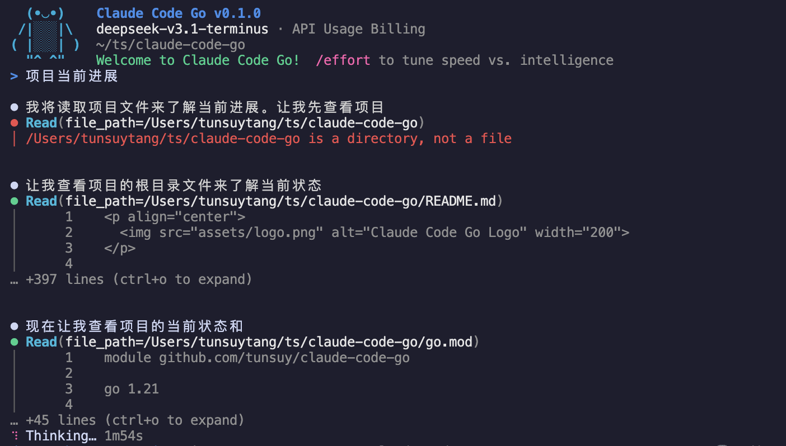
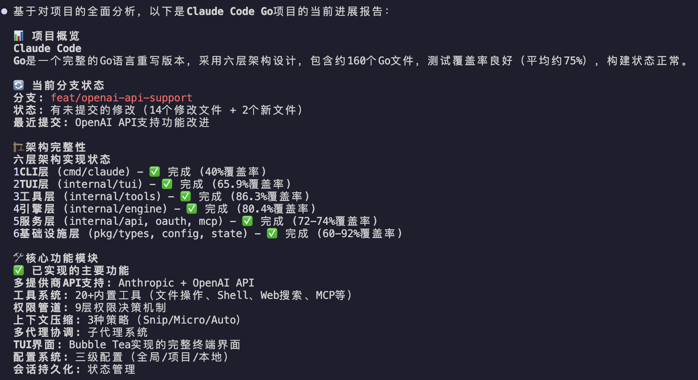

<p align="center">
  
</p>

<h1 align="center">Claude Code Go</h1>

<p align="center">
  <strong>🤖 A Go reimplementation of Claude Code — AI coding assistant in your terminal</strong>
</p>

<p align="center">
  <a href="https://golang.org/dl/"></a>
  <a href="https://goreportcard.com/report/github.com/tunsuy/claude-code-go"></a>
  <a href="https://codecov.io/gh/tunsuy/claude-code-go"></a>
  <a href="https://pkg.go.dev/github.com/tunsuy/claude-code-go"></a>
  <a href="https://github.com/tunsuy/claude-code-go/actions/workflows/ci.yml"></a>
  <a href="https://github.com/tunsuy/claude-code-go/releases"></a>
  <a href="LICENSE"></a>
  <a href="https://github.com/tunsuy/claude-code-go/pulls"></a>
</p>

<p align="center">
  <a href="README.md">English</a> •
  <a href="README.zh-CN.md">简体中文</a> •
  <a href="README.ja.md">日本語</a> •
  <a href="README.ko.md">한국어</a> •
  <a href="README.es.md">Español</a> •
  <a href="README.fr.md">Français</a>
</p>

---

<p align="center">
  
  <br>
  <em>Interactive TUI with file reading and real-time thinking display</em>
</p>

<p align="center">
  
  <br>
  <em>Comprehensive project analysis with architecture breakdown</em>
</p>

---

## What is this?

This project is a **complete Go reimplementation of [Claude Code](https://claude.ai/code)** — Anthropic's official TypeScript CLI — rewritten module-by-module in Go, covering all core features: TUI, tool use, permission system, multi-agent coordination, MCP protocol, session management, and more.

### Built entirely by AI agents — zero human-written code

> **No human wrote a single line of production code in this repository.**

The entire project — architecture design, detailed design docs, parallel implementation, code review, QA, and integration testing — was produced by **9 Claude AI agents** collaborating in a structured multi-agent workflow:

```
PM Agent          →  project plan, milestones, task scheduling
Tech Lead Agent   →  architecture design, design-doc review, code review
Agent-Infra       →  infrastructure layer (types, config, state, session)
Agent-Services    →  services layer (API client, OAuth, MCP, compaction)
Agent-Core        →  core engine (LLM loop, tool dispatch, coordinator)
Agent-Tools       →  tools layer (file, shell, search, web — 18 tools)
Agent-TUI         →  UI layer (Bubble Tea MVU, themes, Vim mode)
Agent-CLI         →  entry layer (Cobra CLI, DI, bootstrap phases)
QA Agent          →  test strategy, per-layer acceptance, integration tests
```

Each agent worked on an isolated Git Worktree branch in parallel, collaborating through the shared codebase, design docs, and QA reports. The result: ~**7,000 lines of production code + a full test suite**, with `go test -race ./...` passing.

This is a real-world demonstration that a non-trivial, multi-layer Go application can be fully designed, implemented, reviewed, and shipped by AI agents collaborating asynchronously. The complete decision trail lives in [`docs/project/`](docs/project/).

---

A Go implementation of [Claude Code](https://claude.ai/code) — an agentic AI coding assistant that lives in your terminal. Claude Code understands your codebase, runs tools, and helps you write, review, and refactor code through natural conversation.

## Features

- **Interactive TUI** — Full-featured terminal UI built with [Bubble Tea](https://github.com/charmbracelet/bubbletea), with dark/light themes
- **Agentic tool use** — File reads/writes, shell execution, search, and more, all mediated through a permission layer
- **Multi-agent coordination** — Spawn background sub-agents for parallel tasks
- **MCP support** — Connect external tools via the [Model Context Protocol](https://modelcontextprotocol.io)
- **CLAUDE.md memory** — Auto-loads project context from `CLAUDE.md` files up the directory tree
- **Session management** — Resume previous conversations; compact long histories automatically
- **Vim mode** — Optional Vim key bindings in the input area
- **OAuth + API key auth** — Sign in with Anthropic OAuth or supply an `ANTHROPIC_API_KEY`
- **18 built-in slash commands** — `/help`, `/clear`, `/compact`, `/commit`, `/diff`, `/review`, `/mcp`, and more
- **Streaming responses** — Real-time token streaming with thinking-block display

## Architecture

Claude Code Go is organized in six layers:

```
┌─────────────────────────────────────┐
│  CLI (cmd/claude)                   │  cobra entry point
├─────────────────────────────────────┤
│  TUI (internal/tui)                 │  Bubble Tea MVU interface
├─────────────────────────────────────┤
│  Tools (internal/tools)             │  file, shell, search, MCP tools
├─────────────────────────────────────┤
│  Core Engine (internal/engine)      │  streaming, tool dispatch, coordinator
├─────────────────────────────────────┤
│  Services (internal/api, oauth,     │  Anthropic API, OAuth, MCP client
│            mcp, compact)            │
├─────────────────────────────────────┤
│  Infra (pkg/types, internal/config, │  types, config, state, hooks, plugins
│         state, session, hooks)      │
└─────────────────────────────────────┘
```

See [`docs/project/architecture.md`](docs/project/architecture.md) for a detailed breakdown.

## Requirements

- Go 1.21 or later
- An [Anthropic API key](https://console.anthropic.com/) **or** Claude.ai account (OAuth)

## Installation

### From source

```bash
git clone https://github.com/tunsuy/claude-code-go.git
cd claude-code-go
make build
# Binary is placed at ./bin/claude
```

Add to your `PATH`:

```bash
export PATH="$PATH:$(pwd)/bin"
```

### Using `go install`

```bash
go install github.com/tunsuy/claude-code-go/cmd/claude@latest
```

## Quick Start

```bash
# Set your API key (or use OAuth — see Authentication below)
export ANTHROPIC_API_KEY=sk-ant-...

# Start an interactive session in the current directory
claude

# Ask a one-shot question and exit
claude -p "Explain the main entry point of this project"

# Resume the most recent session
claude --resume
```

## Authentication

**API key (recommended for CI/scripts):**

```bash
export ANTHROPIC_API_KEY=sk-ant-...
```

**OAuth (recommended for interactive use):**

```bash
claude /config    # opens the OAuth flow in your browser
```

## API Providers

Claude Code Go supports multiple API providers, allowing you to use not just Anthropic's API, but also OpenAI-compatible APIs.

### Supported Providers

| Provider | Description | Environment Variables |
|----------|-------------|----------------------|
| `direct` (default) | Anthropic Direct API | `ANTHROPIC_API_KEY`, `ANTHROPIC_BASE_URL` |
| `openai` | OpenAI & compatible APIs | `OPENAI_API_KEY`, `OPENAI_BASE_URL` |
| `bedrock` | AWS Bedrock | AWS credentials via environment |
| `vertex` | Google Cloud Vertex AI | GCP credentials via environment |

### Using OpenAI-Compatible APIs

To use OpenAI, DeepSeek, Qwen, Moonshot, or any OpenAI-compatible API:

**Method 1: Environment Variables**

```bash
# Set provider to openai
export CLAUDE_PROVIDER=openai

# Set your API key
export OPENAI_API_KEY=sk-xxx

# Optionally set a custom base URL (for OpenAI-compatible services)
export OPENAI_BASE_URL=https://api.deepseek.com  # DeepSeek
# export OPENAI_BASE_URL=https://api.moonshot.cn/v1  # Moonshot
# export OPENAI_BASE_URL=http://localhost:11434/v1  # Ollama

# Set the model
export OPENAI_MODEL=deepseek-chat

# Run Claude Code
claude
```

**Method 2: Configuration File**

Create or edit `~/.config/claude-code/settings.json`:

```json
{
  "provider": "openai",
  "apiKey": "sk-xxx",
  "baseUrl": "https://api.openai.com",
  "model": "gpt-4-turbo",
  "openaiOrganization": "org-xxx",
  "openaiProject": "proj-xxx"
}
```

### Provider-Specific Notes

**OpenAI:**
- Supports all GPT-4 and GPT-3.5 models
- Full tool/function calling support
- Streaming responses

**DeepSeek:**
```bash
export CLAUDE_PROVIDER=openai
export OPENAI_API_KEY=sk-xxx
export OPENAI_BASE_URL=https://api.deepseek.com
export OPENAI_MODEL=deepseek-chat
```

**Ollama (local):**
```bash
export CLAUDE_PROVIDER=openai
export OPENAI_BASE_URL=http://localhost:11434/v1
export OPENAI_MODEL=llama3
```

**Azure OpenAI:**
```bash
export CLAUDE_PROVIDER=openai
export OPENAI_API_KEY=your-azure-key
export OPENAI_BASE_URL=https://your-resource.openai.azure.com
export OPENAI_MODEL=your-deployment-name
```

## Usage

### Interactive mode

```
claude [flags]
```

| Flag | Description |
|------|-------------|
| `--resume` | Resume the most recent session |
| `--session <id>` | Resume a specific session by ID |
| `--model <name>` | Override the default Claude model |
| `--dark` / `--light` | Force dark or light theme |
| `--vim` | Enable Vim key bindings |
| `-p, --print <prompt>` | Non-interactive: run a single prompt and exit |

### Slash commands

Type `/` in the input to see all available commands:

| Command | Description |
|---------|-------------|
| `/help` | Show all commands |
| `/clear` | Clear conversation history |
| `/compact` | Summarise history to reduce context usage |
| `/exit` | Exit Claude Code |
| `/model` | Switch Claude model |
| `/theme` | Toggle dark/light theme |
| `/vim` | Toggle Vim mode |
| `/commit` | Generate a git commit message |
| `/review` | Review recent changes |
| `/diff` | Show current diff |
| `/mcp` | Manage MCP servers |
| `/memory` | Show loaded CLAUDE.md files |
| `/session` | Show session info |
| `/status` | Show API/connection status |
| `/cost` | Show token usage and estimated cost |

## Development

### Prerequisites

- Go 1.21+
- `golangci-lint` (optional, for linting)

### Build & test

```bash
# Build
make build

# Run all tests
make test

# Run tests with coverage report
make test-cover

# Vet
make vet

# Lint (requires golangci-lint)
make lint

# Build + test + vet
make all
```

### Project layout

```
claude-code-go/
├── cmd/claude/          # CLI entry point
├── internal/
│   ├── api/             # Anthropic API client & streaming
│   ├── bootstrap/       # App initialisation
│   ├── commands/        # Slash command handlers
│   ├── compact/         # Conversation compaction
│   ├── config/          # Configuration (file + env)
│   ├── coordinator/     # Multi-agent coordinator
│   ├── engine/          # Query engine, tool dispatch
│   ├── hooks/           # Pre/post-tool hooks
│   ├── mcp/             # MCP server management
│   ├── memdir/          # CLAUDE.md loader
│   ├── oauth/           # OAuth2 flow
│   ├── permissions/     # Tool permission layer
│   ├── plugin/          # Plugin system
│   ├── session/         # Session persistence
│   ├── state/           # Application state
│   ├── tools/           # Tool interface, registry & built-in implementations
│   │   ├── agent/       #   sub-agent & send-message tools
│   │   ├── fileops/     #   file read/write/edit/glob/grep tools
│   │   ├── interact/    #   user-interaction & worktree tools
│   │   ├── mcp/         #   MCP tool adapter
│   │   ├── misc/        #   miscellaneous tools
│   │   ├── shell/       #   Bash execution tool
│   │   ├── tasks/       #   task-list tools
│   │   └── web/         #   web fetch & search tools
│   └── tui/             # Bubble Tea UI components
├── pkg/
│   └── types/           # Shared public types
├── docs/                # Design docs and QA reports
├── Makefile
└── go.mod
```

## Roadmap

Claude Code Go is currently at **~65% feature parity** with the original TypeScript version. Here's our phased plan to reach v1.0:

| Phase | Version | Key Goals | Timeline |
|-------|---------|-----------|----------|
| **Phase 1** | v0.2.0 | 🔒 Permission system integration, Hook system wiring, test coverage baseline, CI hardening | +3 weeks |
| **Phase 2** | v0.3.0 | 🔧 Complete all 22 tools (currently 11), full CLI subcommands, slash command enhancements, Agent tool | +3 weeks |
| **Phase 3** | v0.4.0 | 🌐 AWS Bedrock & GCP Vertex providers, MCP WebSocket transport, plugin system, feature flags | +4 weeks |
| **Phase 4** | v0.5.0 | 🚀 LSP integration, Remote/Server mode, Voice input, Vim mode, Extended Thinking, Cost Tracker | +4 weeks |
| **Phase 5** | v1.0.0 | 🎯 Performance tuning, security audit, full documentation, multi-platform release | +2 weeks |

### Current Status

```
Completion: ████████████░░░░░░░░ 65%

✅ Done: Core engine, TUI, API client (Direct + OpenAI), context compaction,
         OAuth, session persistence, 11 tools, 14 slash commands
⚠️  WIP:  Bedrock/Vertex providers, MCP WebSocket, remaining tools & commands
❌ Todo: Permission wiring, Hook wiring, LSP, plugin system, Remote mode
```

📋 See the **[full Roadmap](docs/ROADMAP.md)** for detailed task breakdowns, architecture diagrams, and completion criteria.

## Contributing

We welcome contributions! Please read [CONTRIBUTING.md](CONTRIBUTING.md) before submitting a pull request.

Quick checklist:
- Fork the repo and create a feature branch
- Make sure `make test` and `make vet` pass
- Write tests for new functionality
- Follow existing code style (run `gofmt ./...`)
- Open a pull request using the provided template

## Security

To report a security vulnerability, please see [SECURITY.md](SECURITY.md). **Do not** open a public GitHub issue for security bugs.

## License

This project is licensed under the MIT License — see [LICENSE](LICENSE) for details.

## Related projects

- [claude-code](https://github.com/anthropics/claude-code) — the original TypeScript CLI
- [anthropic-sdk-go](https://github.com/anthropics/anthropic-sdk-go) — official Go SDK for the Anthropic API
- [Model Context Protocol](https://modelcontextprotocol.io) — open standard for connecting AI to tools
